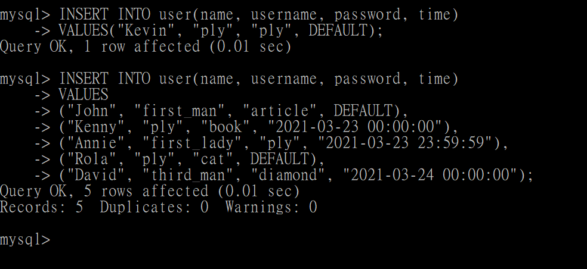

# Assignment 5

## 要求三
#### 1. SQL指令：
```SQL
INSERT INTO user(name, username, password) VALUES ("Kevin", "ply", "ply");
INSERT INTO user(name, username, password, time)
VALUES 
("John", "first_man", "article", DEFAULT),
("Kenny", "ply", "book", "2021-03-23 00:00:00"),
("Annie", "first_lady", "ply", "2021-03-23 23:59:59"),
("Rola", "ply", "cat", DEFAULT),
("David", "third_man", "diamond", "2021-03-24 00:00:00");
```
#### 執行結果圖：



#### 2. SQL指令：
```SQL
SELECT * FROM user;
```
#### 執行結果圖：


#### 3. SQL指令：
```SQL
SELECT COUNT(*) AS total_amount FROM user;
```
#### 執行結果圖：


#### 4. SQL指令：
```SQL
SELECT * FROM user
ORDER BY time DESC;
```
#### 執行結果圖：


#### 5. SQL指令：
```SQL
SELECT * FROM user
WHERE id BETWEEN 2 AND 4
ORDER BY time DESC;
```
#### 執行結果圖：


#### 6. SQL指令：
```SQL
SELECT * FROM user
WHERE username="ply";
```
#### 執行結果圖：


#### 7. SQL指令：
```SQL
SELECT * FROM user
WHERE username="ply" AND password="ply";
```
#### 執行結果圖：


#### 8. SQL指令：
```SQL
UPDATE user
SET name="丁滿"
WHERE username="ply";
```
#### 執行結果圖：


#### 9. SQL指令：
```SQL
DELETE FROM user;
```
#### 執行結果圖：


## 要求四
#### 1. SQL指令：
```SQL
SELECT name "姓名", content "留言"
FROM user t1
INNER JOIN message t2
ON t1.id = t2.user_id;
```
#### 執行結果圖：


#### 2. SQL指令：
```SQL
SELECT name "姓名", username, content "內容"
FROM user u
INNER JOIN message m
ON u.id = m.user_id WHERE u.username="ply";
```
#### 執行結果圖：

